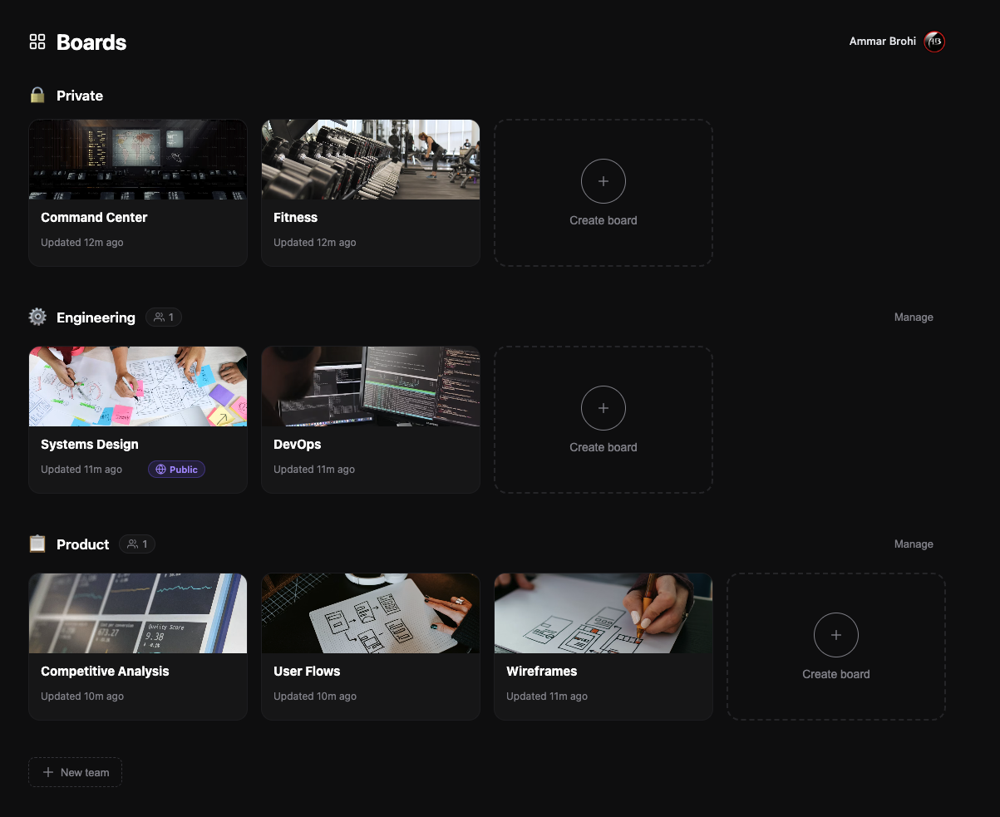

<h1 align="center">Slate</h1>

<p align="center">
  The whiteboard your whole team draws on. A multi-user, self-hostable fork of
  <a href="https://github.com/excalidraw/excalidraw">Excalidraw</a> — with accounts,
  team spaces, sharing, and realtime sync to your own backend.
</p>

<p align="center">
  <strong><a href="https://slate.ammarbrohi.com/">▶ Live demo — slate.ammarbrohi.com</a></strong>
</p>

<p align="center">
  <a href="https://slate.ammarbrohi.com/">
    
  </a>
</p>

---

## What is Slate?

Excalidraw is a brilliant local-first whiteboard. **Slate** keeps the editor and
adds everything you need to run it as a real multi-user product:

- **Accounts** via [Clerk](https://clerk.com) (identity only — teams & boards live in your own Postgres)
- **Boards dashboard** — private boards + team spaces, Trello-style cards with custom backgrounds
- **Team spaces** — create teams, invite by email (pending invites auto-claim on signup), emoji icons, manage members
- **Sharing** — invite people to a board, or generate a password-protected public link
- **Realtime collaboration** — the same end-to-end-encrypted socket protocol as Excalidraw, relayed by your server
- **Self-hostable** — Postgres for board metadata + encrypted scene snapshots, MinIO/S3 for image files. One `docker compose up`.

Scenes and image files are **end-to-end encrypted on the client** — the server only ever stores opaque ciphertext.

## Architecture

```
excalidraw-app/   React app (editor + Boards dashboard, landing, auth)
packages/         The Excalidraw editor library (@excalidraw/*)
server/           Sync backend — Bun + Hono + socket.io + Postgres + S3/MinIO
```

- **Identity**: Clerk issues sessions; the server verifies them via JWKS. Teams, boards, members and sharing are modeled in Postgres (not Clerk Organizations).
- **Storage**: board metadata + encrypted scene snapshot in Postgres; encrypted image blobs in MinIO (or any S3 — e.g. Cloudflare R2).
- **Realtime**: the server is a dumb encrypted relay speaking the `excalidraw-room` socket protocol; reconciliation stays client-side.

## Quick start

### 1. Backend (Docker)

```bash
cd server
cp .env.example .env        # fill in JWT_SECRET, Postgres + MinIO creds, CLERK_ISSUER
docker compose up -d --build
```

Brings up the sync server (`:3002`), Postgres, and MinIO (S3-compatible file store,
persisted to `server/data/`). Schema migrations run on boot.

To use **Cloudflare R2** instead of the bundled MinIO, drop the `minio` services and
point `S3_ENDPOINT` / keys at R2 (`S3_FORCE_PATH_STYLE=false`).

### 2. Frontend

```bash
yarn install
# enable Clerk by putting your publishable key in .env.development.local:
#   VITE_APP_CLERK_PUBLISHABLE_KEY=pk_test_...
# (leave it empty to use the built-in dev login — no Clerk needed)
yarn start                  # http://localhost:3001
```

`VITE_APP_SYNC_SERVER` and `VITE_APP_WS_SERVER_URL` default to `http://localhost:3002`.

## Configuration

**Frontend** (`.env.development.local`, gitignored):

| Var | Purpose |
| --- | --- |
| `VITE_APP_CLERK_PUBLISHABLE_KEY` | Clerk key; empty → built-in dev login |
| `VITE_APP_SYNC_SERVER` | Sync server URL |
| `VITE_APP_WS_SERVER_URL` | Realtime socket URL |

**Backend** (`server/.env`, gitignored — see `server/.env.example`): `JWT_SECRET`,
`POSTGRES_*`, `MINIO_ROOT_*` / `S3_*`, `CLERK_ISSUER`, bruteforce limits.

## Development

```bash
yarn test:typecheck   # TypeScript
yarn test:update      # tests (with snapshot updates)
yarn fix              # format + lint
```

## Credits & license

Slate is a fork of [**Excalidraw**](https://github.com/excalidraw/excalidraw) and
builds entirely on its editor. Huge thanks to the Excalidraw team and contributors.
Slate is **not affiliated with or endorsed by** the Excalidraw project.

The Excalidraw editor is [MIT licensed](packages/excalidraw/LICENSE); this fork
retains that license.
